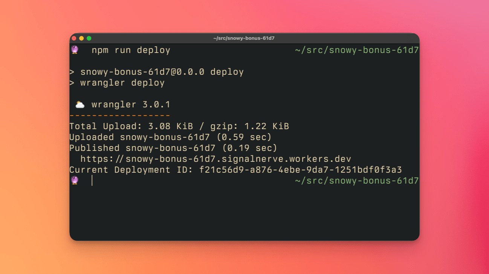
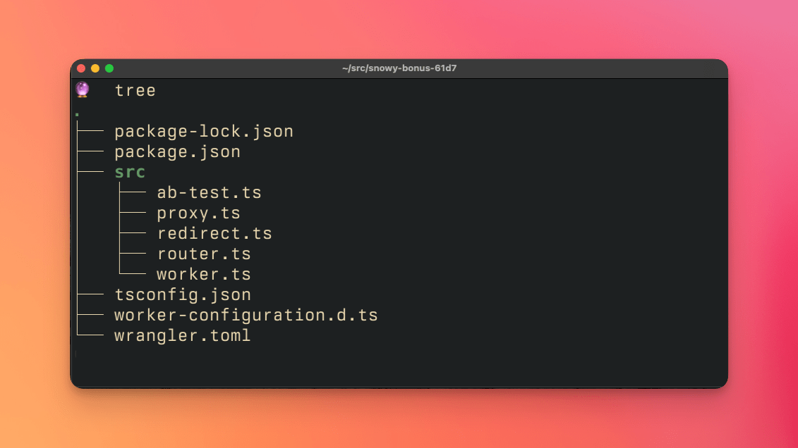

# Create a new project with create-cloudflare-cli

In this tutorial, you will learn how to create a new project using the `create-cloudflare-cli` tool. `create-cloudflare-cli`, or `c3`, is a command-line interface for rapidly creating and deploying projects to Cloudflare. `c3` can be thought of as a quick way to create and prototype an application, and once you've used it to create a project, you will use [`wrangler`](/workers/wrangler) to continue developing and deploying your application.

## Prerequisites

To complete this tutorial, you will need:

- [Node.js](https://nodejs.org/en/) and `npm` installed on your machine
- A [Cloudflare account](https://dash.cloudflare.com/sign-up)
- The free tier of Cloudflare Workers enabled on your Cloudflare account

## Creating a project

To begin, run the command `npm create cloudflare` in your terminal. This will prompt you to enter a project name and select a template. For this tutorial, we will use the "Common Workers Functions" template.


The "Common Workers Functions" provides a number of example functions that can be used to quickly prototype an application. At time of writing, this includes functions for:

- A/B Testing
- Proxying
- Redirects
- Routing

Selecting this option will create a new project directory, install the needed dependencies, and even deploy an initial version of the project to Cloudflare Workers.

## Editing the code

We can create a new endpoint in the `router.ts` file in order to see what it takes to edit the newly created Workers application.

In the below example, a new route `/hello` has been added to the `router.ts` file. This route will respond with a simple message.

```typescript
---
filename: src/router.ts
highlight: [4]
---
// Other defined routes beinning with `router.`
// router.get(...)

router.get('/hello', () => new Response("Hello, developer!"))

// export default router
```

The final version of the `router.ts` file shows a complete example of how to build an application that uses URL-based routing to respond to requests.


## Deploying a project and using Wrangler

To deploy your application, the script `npm run deploy` has been provided. This will use `wrangler`, our fully-featured Cloudflare CLI, to deploy your application to Cloudflare's network.



When you're ready to begin iterating on your codebase, the directory structure for your newly created project gives a good hint as to where to begin. The `src` directory contains your application logic, and the configuration file located in `wrangler.toml` provides configuration options for your application, such as attaching [storage](/products/?product-group=Storage) or configuring [environment variables and secrets](/workers/platform/environment-variables):



## Next steps

Now that you've created a new project, you can continue to develop your application using the [Wrangler CLI](/workers/wrangler) or the [Wrangler VSCode extension](/workers/tooling/wrangler-vscode). If you're looking for more information on how to build applications with Cloudflare Workers, check out the tutorials below:

- [Build a Serverless Slack Bot with Cloudflare Workers](/workers/tutorials/build-a-slackbot)
- [Build a Serverless JAMstack Site with Cloudflare Workers](/workers/tutorials/build-a-jamstack-site)
- [Build a Twilio Notification Service with Cloudflare Workers](/workers/tutorials/github-sms-notifications-using-twilio/)
